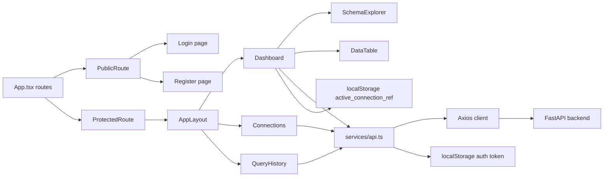
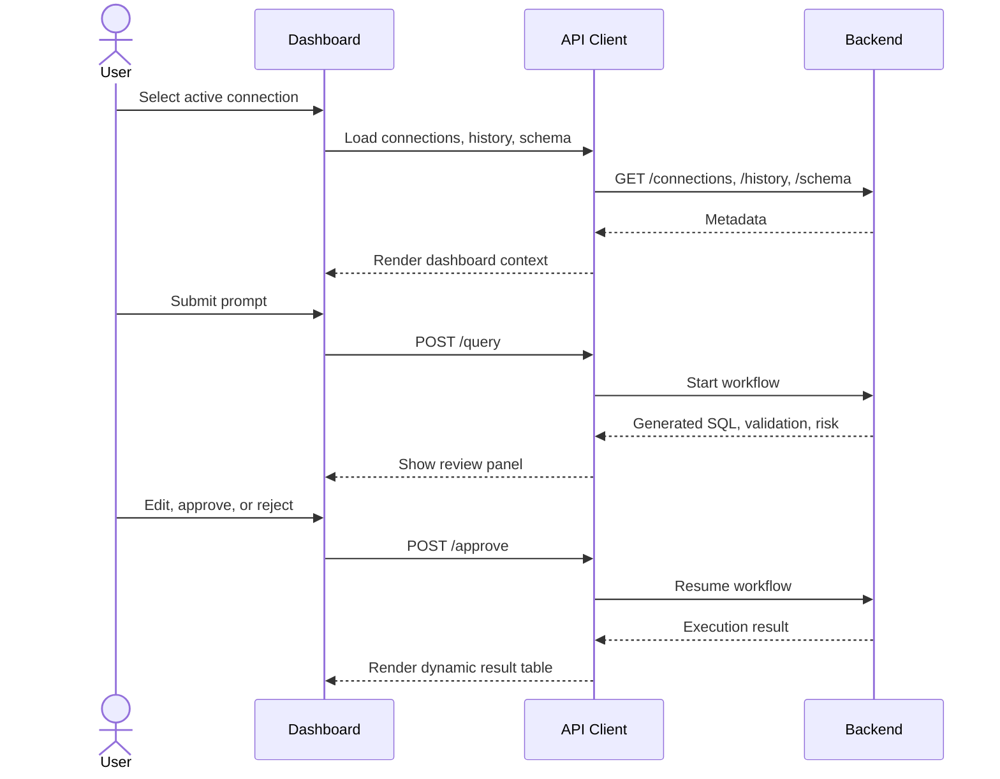

# AI Database Copilot Frontend

The frontend is a React 19 + Vite TypeScript application for operating AI SQL workflows. It provides authentication screens, a tenant dashboard, database connection selection, schema exploration, SQL review/approval controls, query execution results, and workflow history.

## Responsibilities

- Login and registration UI.
- Persist JWT and user profile in `localStorage`.
- Attach Bearer tokens to API requests.
- Protect dashboard routes from unauthenticated users.
- Let users select the active tenant database connection.
- Let admins create new database connections.
- Load schema metadata for the active connection.
- Submit natural-language prompts to the backend.
- Render generated SQL, validation warnings, risk metadata, and execution results.
- Allow SQL copy, edit, approval, rejection, and retry flows.
- Display query history with filtering, status badges, SQL previews, and execution errors.

## Tech Stack

| Area | Technology |
| --- | --- |
| UI runtime | React 19 |
| Build tool | Vite |
| Language | TypeScript |
| Routing | React Router |
| HTTP client | Axios |
| Styling | Tailwind CSS utility classes |
| Production server | Nginx |

## Directory Guide

```text
frontend/
|-- public/                  Static icons and favicon
|-- src/
|   |-- App.tsx              Route definitions and lazy-loaded pages
|   |-- main.tsx             React entry point
|   |-- services/api.ts      Axios client and API wrappers
|   |-- pages/               Login, Register, Dashboard, Connections, History
|   |-- components/
|   |   |-- auth/            ProtectedRoute and PublicRoute
|   |   |-- layout/          App shell, sidebar, top navbar
|   |   |-- schema/          SchemaExplorer
|   |   |-- table/           Dynamic query result table
|   |   `-- ui/              Buttons, cards, badges, spinners, empty states
|   |-- types/               API response/request TypeScript types
|   `-- utils/               Auth, roles, dates, active connection storage
|-- Dockerfile               Vite build + Nginx production image
|-- nginx.conf               SPA fallback config
|-- package.json
|-- vite.config.ts
`-- tailwind.config.js
```

## Frontend Architecture



## Routes

| Path | Access | Component | Purpose |
| --- | --- | --- | --- |
| `/login` | Public only | `Login` | Authenticate existing users |
| `/register` | Public only | `Register` | Create a new user |
| `/dashboard` | Authenticated | `Dashboard` | Generate, review, approve, execute, and inspect SQL |
| `/connections` | Authenticated | `Connections` | Select active connection; admins can create connections |
| `/history` | Authenticated | `QueryHistory` | Review workflow runs and generated SQL |
| `*` | Any | Redirect | Sends unknown routes to `/login` |

## API Integration

The Axios client is defined in `src/services/api.ts`.

Default API base URL:

```text
https://ai-db-copilot.onrender.com
```

For local development, create `frontend/.env`:

```env
VITE_API_BASE_URL=http://127.0.0.1:8000
```

API wrappers:

| Wrapper | Backend endpoint |
| --- | --- |
| `authApi.login` | `POST /login` |
| `authApi.register` | `POST /register` |
| `connectionApi.listConnections` | `GET /connections` |
| `connectionApi.createConnection` | `POST /connections` |
| `schemaApi.getSchema` | `GET /schema?connection_ref=...` |
| `queryApi.generateSql` | `POST /query` |
| `queryApi.approveQuery` | `POST /approve` |
| `historyApi.listHistory` | `GET /history` |

The Axios interceptor reads `access_token` from `localStorage` and sends it as:

```text
Authorization: Bearer <token>
```

On `401`, the client clears auth state and redirects to `/login`.

## UI Workflow



## Important Components

| Component | Purpose |
| --- | --- |
| `AppLayout` | Shared authenticated page shell |
| `Sidebar` | Navigation between dashboard, connections, and history |
| `TopNavbar` | User and page context display |
| `ProtectedRoute` | Blocks authenticated pages without a token |
| `PublicRoute` | Keeps authenticated users out of login/register pages |
| `SchemaExplorer` | Displays table/column schema and inserts schema text into prompts |
| `DataTable` | Renders arbitrary execution result rows |
| `MetricCard` | Dashboard summary metrics |
| `StatusBadge` | Visual status/risk/connection labels |

## Local Setup

```powershell
cd frontend
npm install
npm run dev
```

Open `http://localhost:5173`.

For local backend integration, use:

```env
VITE_API_BASE_URL=http://127.0.0.1:8000
```

## Available Scripts

| Command | Purpose |
| --- | --- |
| `npm run dev` | Start Vite development server |
| `npm run build` | Type-check and create production build |
| `npm run lint` | Run ESLint |
| `npm run preview` | Preview built assets locally |

## Production Build

```powershell
npm run build
```

The production assets are written to `dist/`.

The Dockerfile uses a two-stage build:

1. `node:20-alpine` installs dependencies and runs `npm run build`.
2. `nginx:alpine` serves `dist/` from `/usr/share/nginx/html`.

`nginx.conf` uses SPA fallback:

```nginx
location / {
    try_files $uri /index.html;
}
```

## State Stored in Browser

| Key | Purpose |
| --- | --- |
| `access_token` | JWT used by Axios auth interceptor |
| `user` | Serialized logged-in user profile |
| `active_connection_ref` | Last selected database connection |

Logging out clears all three keys.

## Role-Aware UI

- Admin users can create database connections.
- Developer users can approve and edit reviewed SQL workflows.
- Analyst users see restricted controls and write SQL guardrails in the dashboard.
- Final permission enforcement still happens in the backend.

## Development Notes

- Keep API types in `src/types` aligned with backend response models.
- `Dashboard` currently handles most workflow state locally because SQL generation, editing, approval, retry, and result rendering are tightly coupled.
- The backend can return dynamic row shapes, so `DataTable` accepts `Record<string, string | number | boolean | null>` rows.
- The app uses lazy-loaded pages in `App.tsx` to keep the initial bundle smaller.
